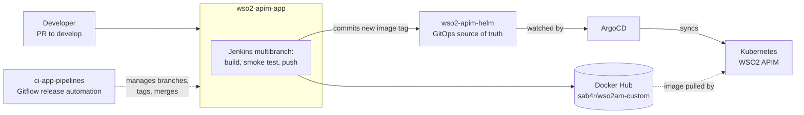

# apim-gitops

**A custom, branded WSO2 API Manager 4.7.0 distribution with end-to-end GitOps delivery on Kubernetes.**

Jenkins builds and tests a customized Docker image, pushes it to Docker Hub, and updates a Helm chart. ArgoCD detects the change and syncs it to the cluster.

> Portfolio and educational project. Read the full write-up: [Coming soon !]([URL](https://blog.endignous.fr/Home)).

---

## Architecture

## Repositories

| Repository | Role | Start here if you want to... |
|---|---|---|
| [`wso2-apim-app`](link) | Custom Docker image, UI customizations, build/test/push pipeline | See how the image is built and versioned |
| [`wso2-apim-helm`](link) | Helm chart, the GitOps source of truth | See how WSO2 is deployed and configured |
| [`ci-app-pipelines`](link) | Jenkins pipelines for Gitflow releases and hotfixes | See how releases are automated |

## Scope

**Delivers:** a custom WSO2 APIM 4.7.0 image (branded Publisher, DevPortal, Admin) and a fully automated build-to-deploy pipeline.

**Out of scope:**
- Cluster provisioning / infrastructure-as-code
- API definitions, mediation sequences, gateway policies (owned by API product teams)
- Production secrets: stored in a secrets manager (CSI Secret Store) and only referenced by the chart
- WSO2 runtime configuration: lives in the chart's per-environment `values.yaml`

## Branching and releases

The project follows **Gitflow**: `feature/*` and `fix/*` merge into `develop`; `release/X.Y.Z` and `hotfix/X.Y.Z` branches are created and finalized by dedicated Jenkins jobs; `main` only holds tagged releases.

| Branch | Image tag | Environment |
|---|---|---|
| `main` | `4.7.0_0.4.0` (+ `latest`) | Production |
| `develop` | `4.7.0_0.5.0-SNAPSHOT-<sha>` | Staging |
| `release/*` | `4.7.0_0.4.0-RC1` | Staging |
| `hotfix/*` | `4.7.0_0.3.1-SNAPSHOT-<sha>` | Staging |
| `feature/*`, `fix/*` | `pr-<id>-<sha>` | None (build + test only) |

Versions follow `<WSO2_VERSION>+<CUSTOM_VERSION>[-SNAPSHOT]`, e.g. `4.7.0+0.5.0-SNAPSHOT`. The `+` becomes `_` in Docker tags.

**To release:** merge PRs into `develop`, run the `CRB` job, (optionally) QA the release branch, then run `Production Finalization`.
**To hotfix:** run `Hotfix Creator` with the base tag, commit the fix, then run `Production Finalization`.

Details, guard rails and diagrams: see [`ci-app-pipelines`](link).

## Tech stack

| Layer | Technology |
|---|---|
| API management | WSO2 API Manager 4.7.0 (all-in-one) |
| Containers | Docker (multi-stage build), Docker Hub |
| CI | Jenkins (declarative pipelines, Groovy), GitHub Checks |
| GitOps | ArgoCD, Helm 3, Kubernetes |
| Networking | Gateway API, nginx Ingress, OpenShift Routes |
| Secrets | CSI Secret Store |
| UI | React (WSO2 Carbon UI), Node.js 22, npm, Lerna |
| Scripting | Groovy, Bash |

## Stakeholders

| Role | Responsibility |
|---|---|
| Platform / DevOps | Pipelines, Helm chart, release automation |
| API product teams | API definitions and policies; merge PRs to `develop` |
| Inetum Tunisie | Owns the branded distribution and deployment targets |
