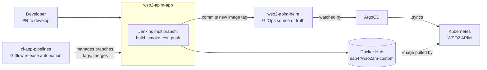

# apim-gitops

**A custom, branded WSO2 API Manager 4.7.0 distribution with end-to-end GitOps delivery on Kubernetes.**

Jenkins builds and tests a customized Docker image, pushes it to Docker Hub, and
updates a Helm chart. ArgoCD detects the change and syncs it to the cluster.

> Portfolio and educational project. Full write-up: [coming soon](https://blog.endignous.fr/Home).

---

## Architecture

**End to end:** a commit on `develop` or `main` → `wso2-apim-app` builds and pushes
the image → it commits the new tag to `wso2-apim-helm` → ArgoCD deploys it.
Releases and hotfixes are cut and finalized by `ci-app-pipelines`, which only
moves branches and tags; the build is always done by `wso2-apim-app`.

## Repositories

| Repository | Role | Start here if you want to... |
|---|---|---|
| [`wso2-apim-app`](https://github.com/apim-gitops/wso2-apim-app) | Custom Docker image, UI customizations, build/test/push pipeline, versioning rules | See how the image is built, versioned and tagged |
| [`wso2-apim-helm`](https://github.com/apim-gitops/wso2-apim-helm) | Helm chart, the GitOps source of truth | See how WSO2 is deployed and configured |
| [`ci-app-pipelines`](https://github.com/apim-gitops/ci-app-pipelines) | Jenkins pipelines for Gitflow releases and hotfixes | See how releases are automated |

## Scope

**Delivers:** a custom WSO2 APIM 4.7.0 image (branded Publisher and DevPortal;
Admin built, branding not yet enabled) and a fully automated build-to-deploy pipeline.

**Out of scope:**
- Cluster provisioning / infrastructure-as-code
- API definitions, mediation sequences, gateway policies (owned by API product teams)
- Production secrets: stored in a secrets manager (CSI Secret Store) and only referenced by the chart
- WSO2 runtime configuration: lives in the chart's values files ([`wso2-apim-helm`](https://github.com/apim-gitops/wso2-apim-helm#configuration))

## Branching and releases

The project follows **Gitflow**: `feature/*` and `fix/*` merge into `develop`;
`release/X.Y.Z` and `hotfix/X.Y.Z` branches are created and finalized by
dedicated Jenkins pipelines; `main` only holds tagged releases.

| Branch | Image tag (example) | Environment |
|---|---|---|
| `main` | `4.7.0_0.4.0` (+ `latest`) | Production |
| `develop` | `4.7.0_0.5.0-SNAPSHOT-<sha>` | Staging |
| `release/*` | `4.7.0_0.4.0-RC1` | Staging |
| `hotfix/*` | `4.7.0_0.3.1-<sha>` | Staging |
| `feature/*`, `fix/*` (PRs) | `pr-<id>-<sha>` | None (build + test only) |

Versions follow `<WSO2_VERSION>+<CUSTOM_VERSION>[-SNAPSHOT]`, e.g.
`4.7.0+0.5.0-SNAPSHOT`. Full rules: [Version format](https://github.com/apim-gitops/wso2-apim-app#version-format)
and [Image tagging](https://github.com/apim-gitops/wso2-apim-app#image-tagging).

**To release:** merge PRs into `develop` → run `Jenkinsfile.release` →
(optionally) QA the release branch → run `Jenkinsfile.production`.
**To hotfix:** run `Jenkinsfile.hotfix` with the base tag → commit the fix →
run `Jenkinsfile.production`.

Step-by-step workflows, guards and Jenkins setup:
[`ci-app-pipelines`](https://github.com/apim-gitops/ci-app-pipelines#workflows).

## Tech stack

| Layer | Technology |
|---|---|
| API management | WSO2 API Manager 4.7.0 (all-in-one) |
| Containers | Docker (multi-stage build), Docker Hub |
| CI | Jenkins (declarative pipelines), GitHub Checks |
| GitOps | ArgoCD, Helm 3, Kubernetes |
| Networking | Gateway API, nginx Ingress, OpenShift Routes |
| Secrets | CSI Secret Store |
| UI | React (WSO2 Carbon UI), Node.js 22, npm, Lerna |
| Scripting | Groovy, Bash |
